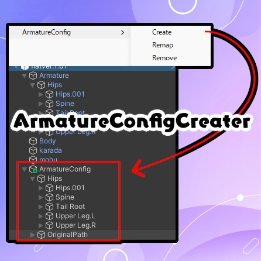
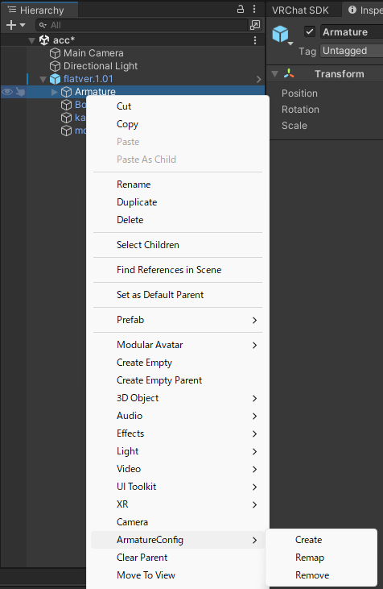
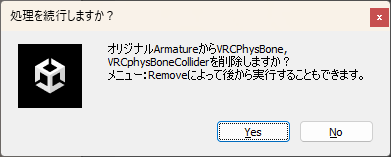

# PandraBox/ArmatureConfigCreater
 
 
- [PandraBox/ArmatureConfigCreater](#pandraboxarmatureconfigcreater)
  - [概要](#概要)
  - [使用方法](#使用方法)
    - [各機能へのアクセス](#各機能へのアクセス)
    - [Create](#create)
    - [Remap](#remap)
    - [Remove](#remove)
  - [ArmatureConfigの仕様](#armatureconfigの仕様)
  - [サポート窓口](#サポート窓口)

## 概要
PhysBone,PhysBoneColliderをアバター本体Armatureと別で管理するためのオブジェクトを生成する**破壊的**ツールです

## 使用方法
### 各機能へのアクセス
- ArmatureConfigCreater.unitypackageを使用したいプロジェクトにインポートしてください
- Armatureを右クリックしてください。ArmatureConfigメニューが追加されています。これが全機能です

### Create
- 基本となる機能です
- Armatureで実行すると、それをコピーしてPB,PBコライダーだけ残した構造を作成します
- 削除について聞かれるので、通常Yesを押して下さい（後から実行することもできます）

- 特に何も表示せず自動的にRemapを実行します

### Remap
- ArmatureConfigのPB,PBコライダーのRootTransformにArmatureの対応するオブジェクトを設定します
- Create時に自動実行されるため基本的に使う必要はありませんが、Armatureをエクスポートし忘れたfbxを読み込んで設定が飛んだ時のリカバリをするときに便利です

### Remove
- **実行したGameObjectそのものとそれ以下**からPB,PBコライダーを削除します
  - ArmatureConfigと元々のArmatureのPB重複を防止するための機能です
  - この仕様上、誤った場所で使うと誤ったPBを消す恐れがありますので注意して使って下さい
- Create時にYesを押したら自動で実行され、オリジナルのアバターから削除します
- 応用的な使い方として、ArmatureConfig自体に使うことでArmatureConfigからPB系統をすべて消すこともできます。そうすると、ArmatureConfigは只の空の構造になります

## ArmatureConfigの仕様
- ArmatureConfigオブジェクトは、オリジナルのArmatureをコピーしたものです。Transformがオリジナルの通り保たれています
- AtmatureConfig直下（通常Hipsと同じ階層）にOriginalPathというGameObjectが作成されます。これはRemapするときに元々のArmatureを識別ために使用されます

## サポート窓口
- 不具合報告・不明点・感想などお気軽にご連絡下さい。お急ぎの際は複数窓口への連絡をお願いいたします
  - [PandraBox問い合わせフォーム](https://forms.gle/x5TvUhqvWwBjQZcn6)
  - [Booth問い合わせフォーム](https://pandrabox.booth.pm/)
  - [X](https://x.com/pandra_gmk)