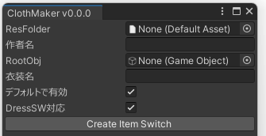
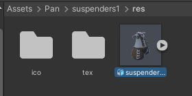
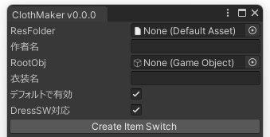

# PandraBox/ClothMaker

- [PandraBox/ClothMaker](#pandraboxclothmaker)
  - [概要](#概要)
  - [導入方法](#導入方法)
  - [使用方法](#使用方法)
  - [参考までに](#参考までに)
  - [アンインストール](#アンインストール)
  - [ライセンス](#ライセンス)
  - [サポート窓口](#サポート窓口)

## 概要

- 次を自動化するfbx自動セットアップツールです。自分用ですが一般的に使うことも可能なので公開しています
  - Merge Armature設定
  - 全Renderer別のOnOffアニメ生成
  - DBT式のAnimator、Merge Animator、Installer, MenuGroupなど設定
  - 対応する名前のアイコン設定

## 導入方法

- 使用したいプロジェクトをバックアップして下さい
- プロジェクトを開いて下さい
- unitypackageをインポートしてください

## 使用方法

- 次の構造をAssets以下に作ってください
  - Assets/自分の名前/衣装の名前/「res」という名前のフォルダ
  - resフォルダの中にfbx・テクスチャ等を保存（さらにフォルダ分けしてもよいです）
  - もしあればresフォルダの中に「ico」フォルダを作成し、次を保存（なければないでいいです）
    - Rendererのオブジェクト名と完全一致する名称.png…各衣装のトグルに使います
    - all.png…メニューフォルダの表示に使います
　- 大体こうなる

- fbxをアバター直下に入れてください　この時見た目上きちんと着れている必要があります
- Unity上部メニューよりPan/ClothMakerを実行し、次の設定をして下さい

  - ResFolderに先ほど作ったresフォルダをD&Dします。作者名が認識されるので正しいことを確認してください（違う場合フォルダ構造が間違っているかバグです）
  - RootObjに先ほどHierarchyに入れたfbxを入れてください
  - 必要に応じ衣装名を修正してください
  - デフォルトオフにしたければチェックを外します
  - 幣ツール[DressSW](https://booth.pm/ja/items/6419655)に対応させるならチェックを残します
- Create Item Switchを押すと色々なセッティングが完了します

## 参考までに

- 私は衣装名フォルダの直下にprefabを作ってそれを配布します。こうするとユーザーが一番わかりやすいと思います
- 配布物にはClothMakerは含まれません（含む必要はありませんし、含まないほうがよいでしょう）

## アンインストール

- 破壊的なツールのため、このツールで実行した編集内容を自動的に治す方法はありません。
  - 次を行うのでそれを消せば戻ります
    - 衣装ルートにMergeAnimatorの追加
    - 衣装ルートにGimmikオブジェクトを作成し、その中で色々作業
    - アイコン画像をAlphaIsTransparency, Clamp, 256に設定
    - resフォルダ内にanimフォルダを作り色々作成
    - resフォルダ内にDressSW.txtを作成
- ツールそのものの削除のためには、Assets/Pan/ClothMakerを削除してください

## ライセンス

- [MITライセンス](https://github.com/pandrabox/DressSW?tab=MIT-1-ov-file)によります(配布物がソースであるためその形での公開になります)

## サポート窓口

- 不具合報告・不明点・感想などお気軽にご連絡下さい。お急ぎの際は複数窓口への連絡をお願いいたします
  - [PandraBox問い合わせフォーム](https://forms.gle/x5TvUhqvWwBjQZcn6)
  - [Booth問い合わせフォーム](https://pandrabox.booth.pm/)
  - [X](https://x.com/pandra_gmk)