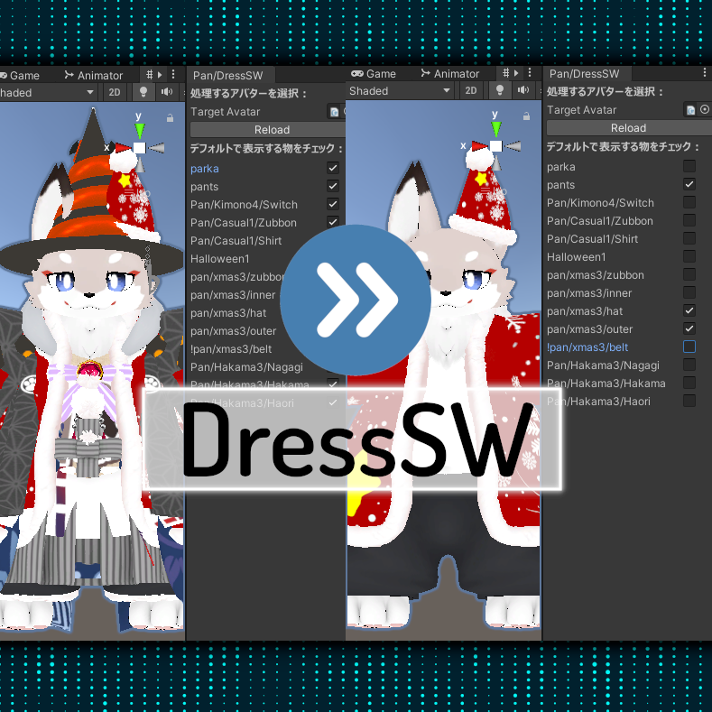
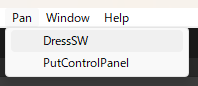
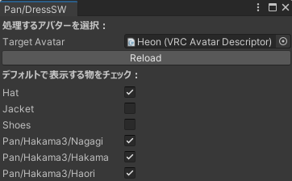
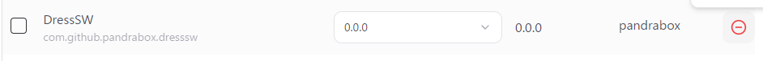
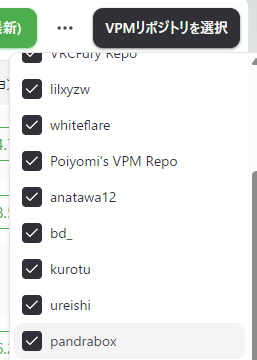

# PandraBox/DressSW

- [PandraBox/DressSW](#pandraboxdresssw)
  - [概要](#概要)
  - [導入方法](#導入方法)
  - [使用方法](#使用方法)
  - [機能拡張](#機能拡張)
  - [アンインストール](#アンインストール)
  - [ライセンス](#ライセンス)
  - [サポート窓口](#サポート窓口)

## 概要

- MA・ExpressionParameterで設計されている衣装ON・OFFギミックのデフォルト状態を管理するものです
- 破壊的変更を加えます。事前にバックアップを行い、自衛のうえご利用ください

## 導入方法

- 使用したいプロジェクトをバックアップして下さい
- プロジェクトを開いて下さい
- unitypackageをインポートしてください

## 使用方法

- Unity上部メニューよりPan/DressSWを実行してください

- TargetAvatar
  - 本ツールで操作するアバターです
  - デフォルトでは一番上にあるアバターが読み込まれます
  - 複数使っているプロジェクトでは適切なものを選んでください
- Reload
  - 本ツールでアバター読み込み後、新たに衣装を追加した場合に押すと表示を更新します
- 各チェックボックス
  - チェックをいれているものはデフォルトで表示されます
  - チェックを外しているものはデフォルトで非表示になります

## 機能拡張

- DressSW.txt
  - 概要
    - 本アセットはプロジェクト内にある全ての「DressSW.txt」から設定を読み込んでデフォルト状態の管理ができるようにします
    - 衣装・アバター製作者は規定のフォーマットに基づいたDressSW.txtを同梱することでDressSWに対応させることができます
  - フォーマット
    - DressSW.txtは改行・カンマ区切りのテキストファイルです
    - フォーマットは次の通りです
      - ExParameter名,制御タイプ,対象オブジェクトパス1,対象オブジェクトパス2,対象オブジェクトパス3,...
        - ExParameter名
          - デフォルト値を切り替えるExParameterの名称を指定します
        - 制御タイプ
          - 次のいずれか3つの数値を指定します
            - 1 … ExParameterがMA Parametersで定義され、スイッチング方式がオブジェクトのActive切り替え（衣装用）
            - 2 … ExParameterがExpressionParametersで定義され、スイッチング方式がオブジェクトのActive切り替え（一般的なアバター用）
            - 3 … ExParameterがExpressionParametersで定義され、スイッチング方式がSkinnedMeshRendererのActive切り替え（一部のアバター用）
            - 4 … ExParameterがMA Parametersで定義され、スイッチング方式がオブジェクトのActive切り替え（衣装用）　**0が衣装有効で1が衣装無効の場合**
        - 対象オブジェクトパス
          - デフォルト状態を切り替えるオブジェクトのパスを指定します
          - 最低1つ必要です。数は自由に増やすことができます
          - アバタールートから定義したい場合は「/」から開始します
            - そうでない場合は、入力したものが何等かの相対パスであるとしてアバター全体から探索し、見つかったもの全部を切り替えます
          - ワイルドカード（*）が使用可能です
    - 行の先頭が//の場合コメント行として扱います
    - 行の先頭が!の場合、ExParameterなしとして扱います
    - 文字コードはUTF8、改行コードはCR+LFを推奨します
  
## アンインストール

- 破壊的なツールのため、このツールで実行した編集内容を自動的に治す方法はありません。

- ツールそのものの削除のためには、VCC等からDressSWを削除して下さい

- 見つからない場合、VPMリポジトリ選択画面よりpandraboxがONになっていることをご確認下さい

## ライセンス

- [MITライセンス](https://github.com/pandrabox/DressSW?tab=MIT-1-ov-file)によります

## サポート窓口

- 不具合報告・不明点・感想などお気軽にご連絡下さい。お急ぎの際は複数窓口への連絡をお願いいたします
  - [PandraBox問い合わせフォーム](https://forms.gle/x5TvUhqvWwBjQZcn6)
  - [Booth問い合わせフォーム](https://pandrabox.booth.pm/)
  - [X](https://x.com/pandra_gmk)