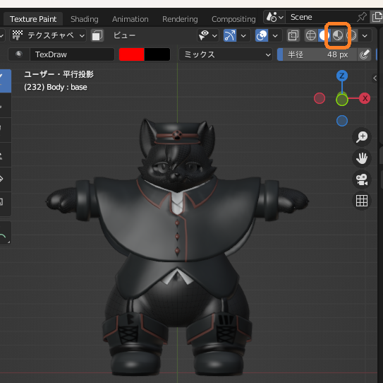
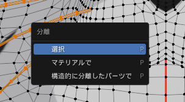
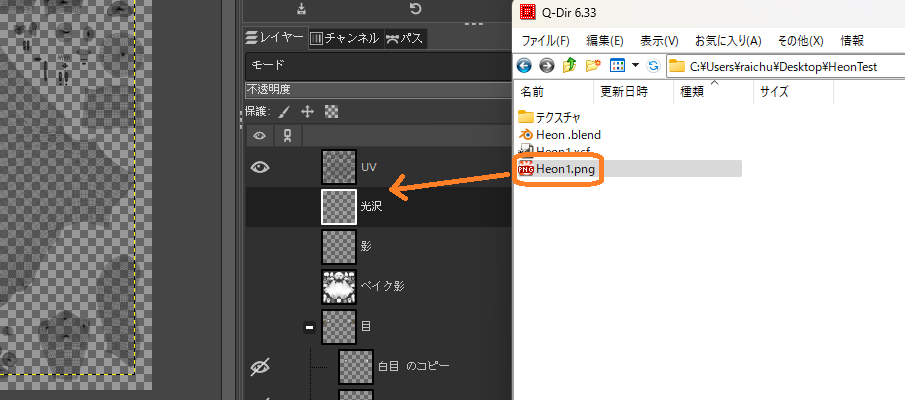
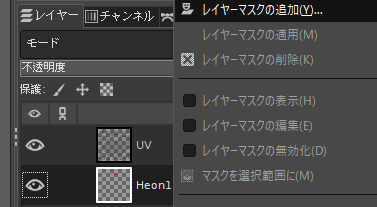

# pandrabox/DressingTable

# Textureの作成方法

- [DressingTable](/manual/DressingTable)は既存のテクスチャに化粧を追加するアセットです。そのためのテクスチャ作成方法の一例です。
    - 私はこうしました、という情報共有でありこれがいい方法かどうかはよくわかりません。あくまで例としてご覧ください。ただし[#インポート後のInspectorの設定](#インポート後のinspectorの設定重要)は重要なのでぜひご覧ください
- Blender3.3.7 Gimp2.10.34を使います

## テクスチャの仮準備

- Body.psdを開く。UVの目のマークをShiftを押しながらクリックするとUVだけになる。

- 名前を付けて保存する（名称：Hoppe等）

- エクスポートする

- 設定例（pngならなんでもよい）

- ここで作成した画像・レイヤデータは後で使うので取っておく

## モデルの準備

- 元になるモデルをBlenderで準備する

- Shadingモードにする

- Bodyを選択する

- 追加→テクスチャ→画像テクスチャ

- こんなふうになる

- 追加→カラー→RGBミックス

- こんなふうになる（ちょっと場所を調整しました）

- 下の画像を参考にして線をつなぐ

- 画像テクスチャで「開く」を押す

- 最初の手順で作ったpngを指定する

- これで本来のテクスチャともう1枚のテクスチャが重なった状態ができました

## Textureのクリア

- Texture Paintモードにする

- 右上の4つある丸アイコンの右から2番目をクリック

- 丸アイコンの右でメニューを展開、レンダーパスをディフューズ色に設定

- 影が消えました

- テクスチャの仮準備で作成したgimpファイルに戻る

- UVの不透明度を0にする（レイヤ非表示にするとうまくいきません）

- エクスポート

- Blenderに戻る

- 左側のメニューより画像→再読み込み

- UV線が消えてきれいになった

## 突起物の取り外し

- ひげ・前髪などがあるモデルの場合うまく塗れないので分離しておきます
- モデルそのものは使わないので雑目に処理して大丈夫です
- Blenderを操作するときは半角になっている必要があります。注意してください

- Bodyが選択されていることを確認し、編集モードにする

- 'A'を押して全選択状態にする。そのあと'AA'を押して全解除状態にする
    - 選択状態にする必要はないのですが、毎手順で確実に全解除するのが大切

- 突起物を構成している点にマウスをあてて、'L'を押す。そのまとまりが選択される

- まとめて外したいものがあれば、どんどんマウスをあてて'L'を押す
    - 間違ったところを選択したらCtrl+Zで戻れます

- 'P'を押して分離する

- 分離したものは非表示にする

- ほかにも突起物があれば同様に処置する（眉毛くらいは大丈夫です）

- 終わったらテクスチャペイントに戻す

- 一旦Blenderを保存して、閉じて、再度開く（元に戻すの履歴を消すため）

## ラフの作成

- ここまでの手順通りにやっていれば「TexturePaint」モードで「テクスチャペイント」で「Body」が選択されているはず。されていないければそうする

- 塗りたい色を決める
    - 気持ち濃いめにしておいてください

- 強さを決める
    - ※透明度です。0.3～0.4くらいがいいと思います。薄めにしてぽんぽん塗ってもいいし、濃いめにして一発描きでもいいです。いろいろやってみましょう
    - 気持ち濃いめにしておいてください

- 強さを決めたところでホイールを回すとメニューが右に行く。x対象になっていることを確認する。

- モデルの上にマウスカーソルを持って行ってキーボードの'['と']'を教えてブラシサイズを調整する
    - はみ出てもいいです
    - リアルのパフくらいのサイズ感にするとやりやすかったです

- 塗る
    - あとで薄くなるため気持ち濃いめに塗ってください
    - ペンで塗るというよりパフでぽんぽんする感じにするとやりやすかったです。好みで
    - この画像はひげを外す手順をやらなかったときの失敗例です。髭の影が入っちゃいました
    - 失敗したらCtrl+Zで戻すとか「画像→再読み込み」で完全クリアとかができます（消しゴムはない）

- 目の部分が少し変な感じになるが後で治すので気にしない

- 塗る
    - 適宜突起物を再表示しつつ変になっていないか確認しながらやるといいです
    - 突起物自体に色を乗せるのも可能ですがちょっと大変なのと物理的におかしい気がする
    - とりあえず今回はこんな感じにしました

- 左メニューの「画像→保存」で保存

## はみ出しのおおまかな修正

- gimpに戻る
- UVの不透明度を上げる

- Blenderで保存した画像（先ほどgimpからエクスポートした画像）をレイヤー画面にD&Dする

- rキーを押すなどして四角選択モードにする

- 明らかに要らない部分を選択してDelで削除

- UVを非表示にしてエクスポート

- Blenderに戻る。「画像→再読み込み」

- 目の中の色が消えてきれいになった

## 好みで目の周りのぼかし・微調整

- 目の周りを自然な感じにぼかします。結構作業が多いうえ試行錯誤があるのでお好みで。

- gimpに戻る。
- 頬紅のレイヤを右クリックし、レイヤマスクの追加

- 完全不透明で追加

- こんなふうになる（特に何も変わらない）

- UVを表示し、目の周りを拡大表示

- uを押すなどしてファジー選択モードにする

- ツール設定で「透明部分選択可、しきい値0」に設定

- UVレイヤをアクティブにして、目の部分を左クリック

- Shiftを押しながらもう片方の目を左クリック

- 選択→選択範囲の拡大　いい感じに拡大する

- 10px位拡大した例

- 色設定の左下を押してメインカラーを黒にする

- 頬紅レイヤのマスク（真っ白なところ）をクリック

- Ctrl+','を押す。マスクのサムネに小さい点ができて、左の画面では選択範囲が透明になる

- Ctrl+Aを押す（全体選択）
- フィルタ→ぼかし→ガウスぼかし

- 画像を見ながらSizeを適当に調整する（最大でも先ほど範囲を広げたサイズまで）。決まったらOKを押す

- UV非表示、再エクスポート、Blenderで画像再読み込み。

- 色の微調整をしたいときはgimpで頬紅レイヤの左側（マスクでない側）をクリックして色→色相-彩度などから変更できます
    - 変更方法はいろいろあります
    - 繰り返しになりますが、実際には薄くなります（不透明度70%程度？）ので濃いめに調整してください

- あとは試行あるのみです

- 絵が描ける方は斜線とかをうまく入れてもいいのかもしれない
- gimpからエクスポートしているものが出来上がった画像そのものなので、それをDressingTableのTexにセットすることで使うことができます。

## インポート後のInspectorの設定(重要)

- インポート後「Alpha is Transparency」「StreamingMipmaps」にチェックをいれる。特にStreamingMipmapのチェックを忘れるとコンパイルエラーでアップロードできなくなるため重要

