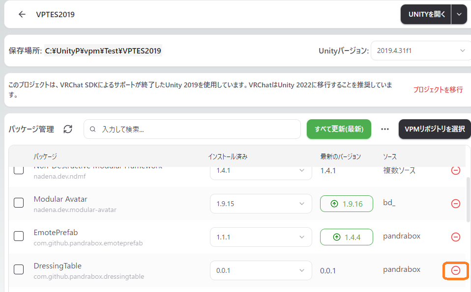

# PandraBox/DressingTable

- [PandraBox/DressingTable](#pandraboxdressingtable)
  - [概要](#概要)
  - [導入方法](#導入方法)
  - [仕様](#仕様)
  - [アンインストール](#アンインストール)
  - [ライセンス](#ライセンス)
  - [サポート窓口](#サポート窓口)

## 概要
頬紅等のちょっとしたアクセントを非破壊で導入できるようにするツールです。Contact連携して距離フェード風の表現ができます

## 導入方法

- 使用したいプロジェクトをバックアップして下さい
- プロジェクトを開いて下さい
- [インストーラ](https://api.anatawa12.com/create-vpai/?name=DressingTable-installer.unitypackage&repo=https://pandrabox.github.io/vpm/index.json&package=com.github.pandrabox.dressingtable&version=%3E=0.0.0)をインポートしてください
- Hierarchyで空のGameObjectを作成し、InspectorでAdd Componentしてください

- Dressing Tableで検索します

- 下のような表示が出れば導入完了です。 仕様ご覧の上設定をお願いします。

## 仕様

- Config
  - Tex
    - このアセットで追加するテクスチャを指定します。「Path」で指定したオブジェクトと同じUVを使って、半透明のテクスチャを指定してください
  - Blend Mode
    - テクスチャの合成方法を指定します。後述のSample機能を使いながら試してください
  - Path
    - このアセットの対象とするオブジェクトの名称を指定します。多くの場合「Body」と入力してください
  - LinkContact
    - Contact Receiverを指定することができます。Proximityコンタクトを指定することによって手・頭などが近づいたときにだんだん表示する表現ができます
    - 指定しないと出しっぱなしまたはCreateMenuによるトグルになります
    - 本機能を使う場合、Sampleよりやや薄目になります（Contact中心が頭の中心になるため）
    - コンタクト設定の推奨設定は次の通りです
      - AllowOthers ON
      - AllowSelfをOFF もしくは HeadのCollisionをOFF
      - HandL, HandRのCollisionをON
      - localOnly OFF
      - Type Proximity
      - 変数名の指定は不要です。してもよいです。自動的に生成または読み込みます
  - Create Menu
    - 機能ON/OFFを切り替えるメニューをExpressionMenu直下に生成します
    - Contactを設定していない場合、完全に表示されている状態/全くない状態を切り替えます
    - Contactを設定している場合、近づくと表示される状態/全くない状態を切り替えます
      - Icon
        - メニューアイコンを指定します
      - MenuName
        - メニューの名称を指定します。省略してもよいですが、重複すると不具合の原因になるためご注意ください
- View Sample
  - ONにするとSceneビューにおいてこのアセットによってテクスチャが追加された状態になります。ほかのオブジェクトに移動したり、ビルドしたりすると自動的にOFFになります。本ギミックは基本的に非破壊ですが、この機能利用中のみは破壊的状況にあるためご注意下さい（OFFにすれば戻ります）
- チェック
  - エラーがある場合、修正しないと本ギミックは動作しません。修正をお願いします
  - ワーニングがある場合、動作する可能性はありますがよりよい設定があるかもしれません（意図して無視する場合もあります）。参考情報として見てください
  
## アンインストール

- 本ギミックは非破壊のためプレハブを削除すれば変更は元に戻ります
- 完全にアンインストールしたい場合、VCC等からDressingTableを削除して下さい

- 見つからない場合、VPMリポジトリ選択画面よりpandraboxがONになっていることをご確認下さい

## ライセンス

- [MITライセンス](https://github.com/pandrabox/DressingTable?tab=MIT-1-ov-file)によります

## サポート窓口
- 不具合報告・不明点・感想などお気軽にご連絡下さい。お急ぎの際は複数窓口への連絡をお願いいたします
  - [PandraBox問い合わせフォーム](https://forms.gle/x5TvUhqvWwBjQZcn6)
  - [Booth問い合わせフォーム](https://pandrabox.booth.pm/)
  - [X](https://x.com/pandra_gmk)