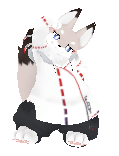
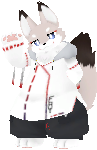
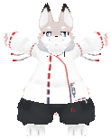

# FlatEmo

本アセットは[らすちんワークス](https://aoikarasu.booth.pm/)製アバターフラット([オリジナル](https://booth.pm/ja/items/3562180),[2nd](https://booth.pm/ja/items/5780006))向け[^フラット向け]のエモートです
プレハブを入れるだけで簡単に使えます

[^フラット向け]:「フラット向け」とはフラットのために作成したが他のアバター（フラット族や、らすちんワークス販売のその他アバター等）で使用可能な可能性が高いことを意味します。ただし、人間アバターなど極端に体形が違う場合には不具合が発生する可能性が高いです。

## はじめに

- 本アセットは非破壊で動作します
- 本アセットはActiveレイヤの上書きをするため、既存のAFK・Emote等の設定はアバターに反映されなくなります（非破壊ですので、プレハブを外せば元に戻ります。）

## 使用手順
1. Unity(2019,2022どちらも可)を起動し、フラットをHierarchyに置く

2. FlatEmoVer1.0.0.unitypackageを読み込む

3. Installを押す[^メッセージ]

[^メッセージ]:環境(依存関係のインストール状況等)によって多少メッセージは違います

4. Assets/Pan/FlatEmoフォルダを開いて、中のprefab2つを **アバター直下に直接[^直接]** 入れる

[^直接]: 一度Hierarchyに置くと「ふわふわ」の風船の位置がずれてしまうため、必ずアバター直下に直接入れて下さい

5. セットアップ完了です。アップロードしてご利用下さい

## 内容一覧

|ふわふわ|ふみ|ジャンプ|かりかり|キック1|
| :---:  | :---: | :---: |:---: |:---: |
||||||

|キック2|キック3|ダンス1|ダンス2|のび|せつめい1|
| :---:  | :---: | :---: |:---: |:---: |:---: |
|||||||

|せつめい2|すわる1|すわる2|おやすみ1|おやすみ2|
| :---:  | :---: | :---: |:---: |:---: |
||||||

|たつ1|たつ2|たつ3|たいそう1|たいそう2|
 | :---: | :---: |:---: |:---: |:---: |
||||||

|ため|うおうお|あるく|をたげい|
| :---: | :---:  | :---: | :---: |
|||||

## 改変について
### モーションの追加
- 次の手順で簡単にモーションが追加できます（別途モーションファイルの準備が必要です）
    - GameObjectを作成
    - AddComponentからEmotePrefabを追加
    - Motion欄にモーションファイルを入れる

### AFKの指定
- 好みのエモートのInspectorよりIsAFKにチェックを入れるとAFKモーションとして使えます。複数指定すると毎回ランダムで実行します
    - 

## 表情が混ざる場合の処置方法
- 次を試行して下さい
  - 表情レイヤの場所を調べる
    - FlatPlusを使っている場合
      - 表情レイヤは0です
    - 使っていない場合
      - VRChatでデバッグコンソールを開く
    
      - FXレイヤの項をみて、表情制御をしているのがどこかを調べる
        - 基本的には「Left Hand」「Right Hand」という名前ですが、表情を別の方法で変更している場合違う名前かもしれません
        - ジェスチャを色々変更したときにStateが変わるものがあればそれです
    
  - 表情重複防止設定をする
    - Pan→PutControlPanelを実行
    
    - 表情レイヤの場所に調べた値（FlatPlusを使っているなら0）を設定
    
- これで治らない場合バグです。再現条件等を添えて[報告](#サポート窓口)頂けると幸いです(条件がわからなくても報告頂けますが、何度かこちらかの質問に対応頂くことがございます。)
  - なおFlatPlusを使っている場合レイヤ0では表情以外にも様々な処理をしているため多少副作用があります。その点はご承知下さい（いずれ修正予定）
  - この機能で対応できない時の対症療法としては次の方法があります
    - 方法1.FlatPlusの表情制御機能を無効にする
      - 機能ONOFFよりLookLockをOFFにして下さい
       
    - 方法2.エモートから表情を削除する
      - 問題を起こすエモートのプレハブを見つけます
        
      - Motion欄をクリックしてProjectビューで該当アニメを見つけます
       
      - Animationウィンドウで詳細を見て、Body: Skinned Mesh Rendererから始まるものをすべて削除します
       
    - 方法3.手動で表情重複防止ギミックを作成する
      - エモート実行時には"CN_IS_ACTION_ACTIVE"というブール値がtrueになるので、それを利用して表情制御を修正することで重複を防止できます

## サポート窓口

- 不具合報告・不明点・感想などお気軽にご連絡下さい。お急ぎの際は複数窓口への連絡をお願いいたします
  - [PandraBox問い合わせフォーム](https://forms.gle/x5TvUhqvWwBjQZcn6)
  - [Booth問い合わせフォーム](https://pandrabox.booth.pm/)
  - [X](https://x.com/pandra_gmk)