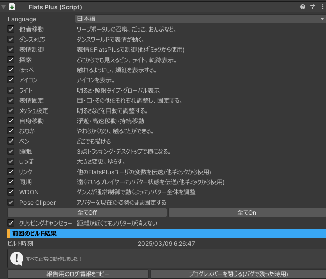

# PandraBox/FlatsPlus

- [PandraBox/FlatsPlus](#pandraboxflatsplus)
  - [概要](#概要)
  - [導入方法](#導入方法)
  - [設定方法](#設定方法)
  - [機能](#機能)
    - [他者移動](#他者移動)
    - [ダンス制御](#ダンス制御)
    - [表情制御](#表情制御)
    - [探索](#探索)
    - [ほっぺ](#ほっぺ)
    - [アイコン](#アイコン)
    - [ライト](#ライト)
    - [表情固定](#表情固定)
    - [メッシュ設定](#メッシュ設定)
    - [自身移動](#自身移動)
    - [おなか](#おなか)
    - [ペン](#ペン)
    - [睡眠](#睡眠)
    - [ガイド](#ガイド)
    - [しっぽ](#しっぽ)
    - [リンク](#リンク)
    - [同期](#同期)
    - [WDON](#wdon)
    - [Pose Clipper](#pose-clipper)
    - [クリッピングキャンセラー](#クリッピングキャンセラー)
  - [参考資料](#参考資料)
  - [アンインストール](#アンインストール)
  - [ライセンス](#ライセンス)
  - [サポート窓口](#サポート窓口)

## 概要

- FlatsPlusはフラット族専用のギミック集です

## 導入方法

- 使用したいプロジェクトをバックアップして下さい
- プロジェクトを開いて下さい
- プロジェクトにFlatsPlus.unitypackageをインポートして下さい
- Assets/Pan/FlatsPlus/FlatsPlus.prefabをアバター直下に入れて下さい

## 設定方法

- 基本的には設定は不要です
- 次の設定が可能です
  - Language
    - 言語が変更できます。設定画面**及びVRC内のメニュー**の言語が設定言語になります
  - チェックボックス
    - 各機能の切り替えを行うことができます
      - 全てON/OFFボタンでまとめて切り替えができます
  - 前回のビルド結果
    - ビルドログに基づいた情報を表示します。（FlatsPlusはエラーが起きてもできる限りで機能適応してアバターアップロードできることを優先します。このためアップロードできたが機能が抜けていることがあり、それのチェックができます）
    - 「報告用のログ情報をコピー」
      - 実行時のログをクリップボードにコピーします。報告のさい添付してください
    - 「プログレスバーを閉じる」
      - 後半の処理実行時にバグが発生するとプログレスバーが開いたままになる現象が確認されています。このボタンを押して閉じます。

## 機能

追々詳細を書きます。またそれぞれ追々詳細設定画面（数値設定や細かい機能のON/OFF等）を実装します

### 他者移動

  - ゲート召喚 … 灰色のゲートを召喚・位置調整・固定する。灰色のゲートは他者からは橙のゲートに見える。灰色のゲートは他者だけが使用できる
  - ゲート有効 … 灰色のゲートの有効を切り替える
  - ゲート申請 … 青のゲートの作成を申請する。近くにFlatsがいると、その位置に青のゲートができる。青のゲートは自分だけが見えて、使用できる
  - 自動申請 … ゲート召喚するときに自動でゲート申請する
  - 抱っこ … 他者を手でもてるようにする
  - おんぶ … 他者が背中に乗れるようになる
  - 距離調整 … 抱っこ・おんぶの距離を調整
  - 角度調整 … 抱っこ・おんぶ・ゲート召喚の角度を調整

### ダンス制御

  - モード:OFF … ダンス制御をOFFにする
  - モード：通常 … デフォルト設定。いくつかのダンスワールドを検出できる。誤検出が少ない
  - モード：パワフル … 全てのダンスワールドを検出できる。誤検出することがある
  - FxEnable … 基本的にON。WDOFFが含まれるアバターではOFFにしないと表情が動かないことがあるが、同期ずれを起こす

### 表情制御

  - FlatsPlusで表情を制御するようにする
    - 現状ではアバター標準のジェスチャーになる
    - 将来的にカスタム機能を作成予定

### 探索

  - ピン … どこからでも見えるピンを有効化
  - 軌跡 … 自分が動いた軌跡を表示
  - 色 … ピン・軌跡の色を変更
  - 軌跡削除 … 軌跡を削除

### ほっぺ

  - ほっぺたに次の機能を追加
    - 触れる
    - 伸ばせる
    - 手を近づけると頬染めを出す
      - 将来的にアバターデフォルトとの干渉をコントロール

### アイコン

  - アイコンを表示する
    - 共鳴…近くのFlatsに共鳴アイコンを表示（自分だけ見える）
    - VersionView…近くのFlatsにFlatsPlusのバージョンを表示

### ライト

  - 前方 … 前を照らす
  - 周囲 … 回りを照らす
  - 明るさ … 明るさを調整
  - グローバル … 他者にみえるかどうかを設定

### 表情固定

  - VRC内で表情を作成し、固定する
    - 有効 … 機能の有効無効を切り替え
    - 目 … 目の種類を選択。スティックで選び、トリガーで決定。
    - 目の強度 … 目の強度を設定
    - 口 … 口の種類を選択
    - その他 … その他の表情を選択。※アバター標準以外のシェイプキーはここに分類される
    - リセット … 設定をクリアすうｒ

### メッシュ設定

  - アバターの明るさを全体的に調整する

### 自身移動

  - 飛行＆高速移動 … 空を移動する。
  - 移動速度 … 飛行時に速度を変更する
  - ホバリング … 浮く
  - ホバリング上下 … ホバリング時前に進んだ時の上下方向を設定する

### おなか

  - おなかがゆれて触れるようにする

### ペン
  - 描画 … ONのとき、右手Fistで描画する

  - 削除 … ONのとき、右手Fistで削除する
  - クリア … 実行すると、描画したものを削除する
  - 色 … 色を変更する

### 睡眠

  - デスクトップ・３点向けの睡眠ギミック
    - 有効 … 睡眠モードをONにする。下半身がアニメで制御される
    - 移動ロック … スティックで実座標が動けないようにする
    - 高さ … 睡眠時の高さを調整する。モーションロックしていない場合は足のみの高さ調整
    - Lock:モーション … 全身をモーションでロックする
    - Lock:今の姿勢 … 全身を現在の姿勢でロックする

### ガイド

  - 有効化 … 画面上に文字で説明を表示する
  - 文字サイズ調整 … 表示する文字を調整する

### しっぽ

  - 大きさ … しっぽのサイズを変更
  - 揺らす … ONにすると、しっぽがゆれる

### リンク

  - 他者移動、アイコンなどの内部で使っている。Flats同士でデータ通信する

### 同期

  - 他者移動で使っている。遠くにいるときにアバターギミックの同期が切れないようにする

### WDON

  - アップロードに全てのレイヤのWriteDefaultをONにする。ダンスに最適化されるが、他のギミックが壊れることがある。

### Pose Clipper

  - Chiled Witch様のPose Clipperを導入する。睡眠から使用している

### クリッピングキャンセラー

  - liltoonの距離クリッピングキャンセラー機能をONにする。**これは破壊的機能です。プレハブを見た瞬間にプロジェクト全体へ影響します。**

## 参考資料

## アンインストール

- 本ギミックは非破壊のためプレハブを削除すれば変更は元に戻ります
- 完全にアンインストールしたい場合、VCC等からDressingTableを削除して下さい
- クリッピングキャンセラーの設定を戻したい場合はlilToonの詳細設定などから戻してください

## ライセンス

- [MITライセンス](https://github.com/pandrabox/DressingTable?tab=MIT-1-ov-file)によります
- PoseClipperについてはフォルダ内同梱のライセンスをご確認ください

## サポート窓口

- 不具合報告・不明点・感想などお気軽にご連絡下さい。お急ぎの際は複数窓口への連絡をお願いいたします
  - [PandraBox問い合わせフォーム](https://forms.gle/x5TvUhqvWwBjQZcn6)
  - [Booth問い合わせフォーム](https://pandrabox.booth.pm/)
  - [X](https://x.com/pandra_gmk)