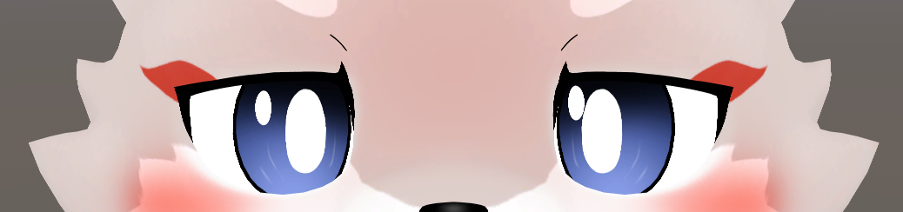
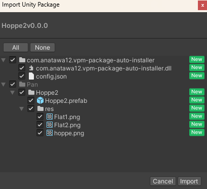
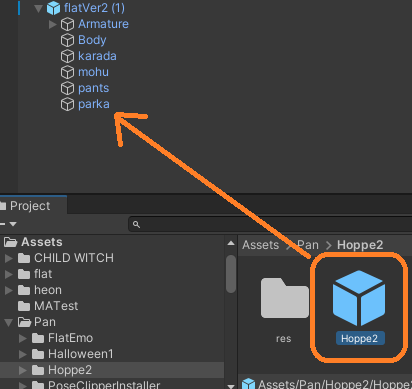
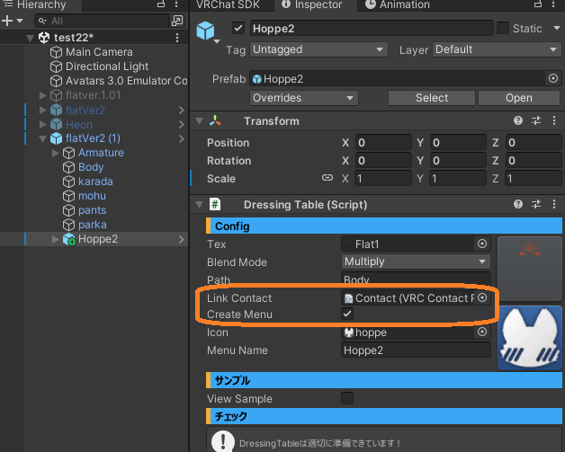
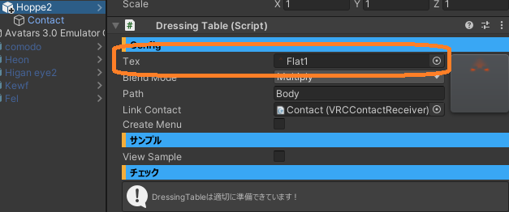
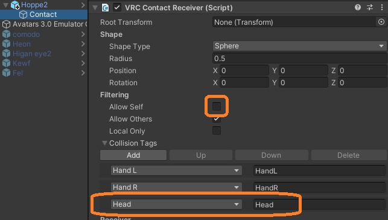
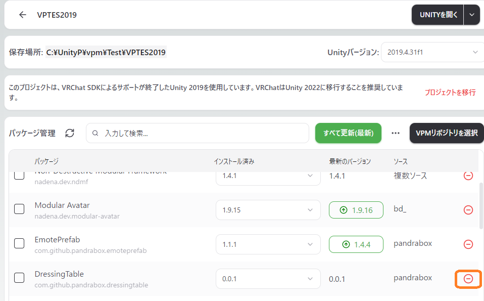
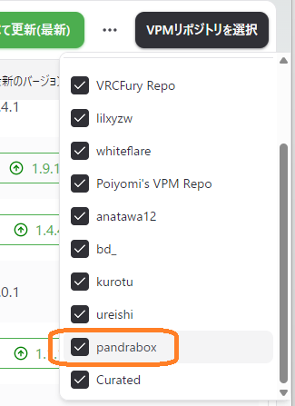

# PandraBox/Hoppe2

- [PandraBox/Hoppe2](#pandraboxhoppe2)
  - [概要](#概要)
  - [導入方法](#導入方法)
  - [改変方法](#改変方法)
    - [ON/OFF方法を変更する](#onoff方法を変更する)
    - [色・形などの変更](#色形などの変更)
    - [自分で反応するようにする](#自分で反応するようにする)
  - [アンインストール](#アンインストール)
  - [ライセンス](#ライセンス)
  - [サポート窓口](#サポート窓口)

## 概要
[DressingTable](DressingTable)を[フラット](https://booth.pm/ja/items/3562180)向けにセットアップしたものです。詳細仕様については[DressingTable](DressingTable)の説明を併せてご覧ください

## 導入方法

- 使用したいプロジェクトをバックアップして下さい
- プロジェクトを開いて下さい
- プロジェクトにHoppe2v*.*.*.unitypackageをインポートして下さい

- Assets/Pan/Hoppe2/Hoppe2.prefabをアバター直下に入れて下さい

## 改変方法

### ON/OFF方法を変更する

- Link Contactを消す　CreateMenuをOff … 常時ON
- Link Contactそのまま　CreateMenuをOff (デフォルト) … 常時手・顔等に反応
- Link Contactを消す　CreateMenuON … メニュー操作で常時ON/OFF切り替え
- Link Contactそのまま CreateMenuをON … メニュー操作で手・顔等に反応とOFF切り替え

### 色・形などの変更

- 改変テクスチャを作成してTexにセットする
  - テクスチャは顔のUVをそのまま使って描いてください

### 自分で反応するようにする

- ContactのAllow SelfをON, Headを削除

## アンインストール

- 本ギミックは非破壊のためプレハブを削除すれば変更は元に戻ります
- 完全にアンインストールしたい場合、VCC等からDressingTableを削除して下さい

- 見つからない場合、VPMリポジトリ選択画面よりpandraboxがONになっていることをご確認下さい

## ライセンス

- [MITライセンス](https://github.com/pandrabox/DressingTable?tab=MIT-1-ov-file)によります

## サポート窓口
- 不具合報告・不明点・感想などお気軽にご連絡下さい。お急ぎの際は複数窓口への連絡をお願いいたします
  - [PandraBox問い合わせフォーム](https://forms.gle/x5TvUhqvWwBjQZcn6)
  - [Booth問い合わせフォーム](https://pandrabox.booth.pm/)
  - [X](https://x.com/pandra_gmk)