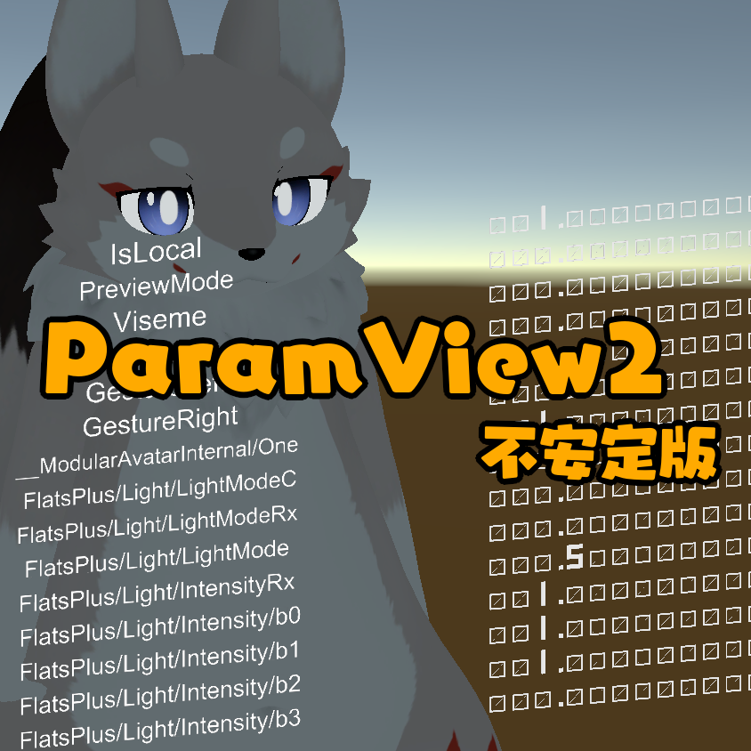
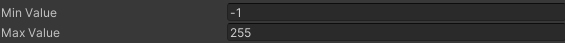
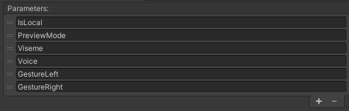
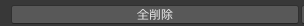
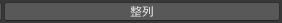
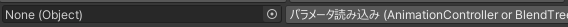
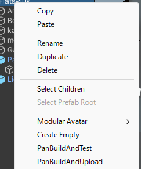
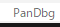

# PandraBox/ParamView2

- [PandraBox/ParamView2](#pandraboxparamview2)
  - [概要](#概要)
  - [利用前の注意](#利用前の注意)
  - [導入方法](#導入方法)
  - [使用方法](#使用方法)
  - [注意](#注意)
  - [同時インストールされる機能](#同時インストールされる機能)
  - [アンインストール](#アンインストール)
  - [ライセンス](#ライセンス)
  - [謝辞](#謝辞)
  - [サポート窓口](#サポート窓口)

## 概要

- VRChat上でパラメータを表示します

## 利用前の注意

- 本ツールは**不安定版**であり**極めて実験的**です。**自己責任**でご利用ください
  - 配布パッケージには本機能とは関係のない機能がいくつか入っています
    - 何かを破壊する意図があるわけではありませんが、**様々な不具合**を起こす恐れがあります
  - 本ツールは予告なく配布停止することがあります
  - 本ツールと**互換性がないアセットを配布**することがあります
  - 本ツールの更新の呼びかけがあったさい、遅滞なく実施してください

## 導入方法

- 使用したいプロジェクトをバックアップして下さい
- プロジェクトを開いて下さい
- Pan/ParamView2/ParamView2.prefabをアバター直下等に入れてください
  - 沢山のパラメータを表示することができ、シーン上に表示されているのは一番上です
  - 直下である必要はありません
    - 適宜他のボーンにつけたりBoneProxyで移動したりしても大丈夫です
  - ParamView2オブジェクトの下のParamDisplay0のTransform・名称等の変更はしないようにしてください

## 使用方法

- とりあえずそのままアップロードするとVRC標準の値をいくつか表示しますので動作チェックを行って下さい

- Min/Max Value
  - 普通の使い方をする場合は変更しなくていいと思いますが、表示範囲を変えたい場合は変更してください
  - 範囲を広げると少数の精度が低くなるようです

- Parameters
  - 表示するパラメータを手入力・追加削除・並べ替え等できます

- 全削除
  - 入力内容をすべて削除します

- 整列
  - アルファベット順で並べ替えます

- 読み込み
  - アニメータ又はBlendTreeを指定すると使用されているパラメータを自動で読み込みます
    - 重複する名前のものは除外されます

## 注意
- 少数の表示について
  - 少数について浮動小数点誤差をそのまま表示するようにしてあります
    - 困る場合はオリジナルのシェーダーで上書きすればいいと思います
- 0を少し小さくしてあります
  - 気に入らない場合はテクスチャを直してください
- 表示数に上限はありませんが、
  - 大量に登録するとビルドに時間がかかります
  - １つのパラメータを表示するために1つのMesh Rendererと2つのマテリアルを使います

## 同時インストールされる機能

- 少なくとも次は入ります。気づいていないだけで他もあるかもしれません
  - PanBuildAndTest/Upload
    - HierarchyでAvatarDescriptorのあるObjectを右クリックして使います（他でも動くかもしれませんが想定外です）
    - TestはBuildAndTestを行いUploadはBuildAndUploadをします
      - BuildAndUploadは一度普通にアップロードしたものだけ動作します
    - チェックしなくていい、経過がコンソールに出る、完了を音で通知するなどの点が便利です
  

- 上部にPanDbgというメニューが出るかもしれません。押さないほうが良いです

## アンインストール

- プレハブを削除してください
- VCCからPandraVaseを削除してください

## ライセンス

- [MITライセンス](https://github.com/pandrabox/DressSW?tab=MIT-1-ov-file)によります(配布物がソースであるためその形での公開になります)

## 謝辞

- 数字の表示はNoriben様の[DisplayNumber](https://github.com/noriben327/DisplayNumber)によります。素晴らしいシェーダーをご提供頂き御礼申し上げます

## サポート窓口

- 不具合報告・不明点・感想などお気軽にご連絡下さい。お急ぎの際は複数窓口への連絡をお願いいたします
  - [PandraBox問い合わせフォーム](https://forms.gle/x5TvUhqvWwBjQZcn6)
  - [Booth問い合わせフォーム](https://pandrabox.booth.pm/)
  - [X](https://x.com/pandra_gmk)