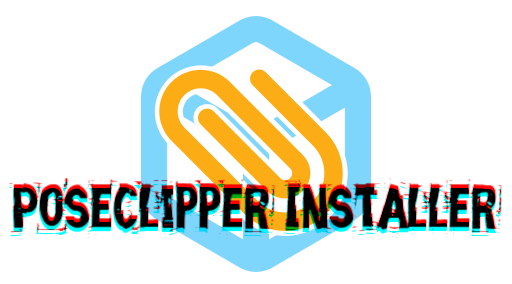
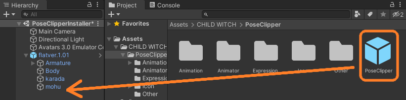
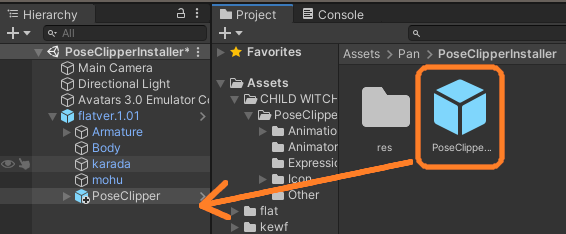
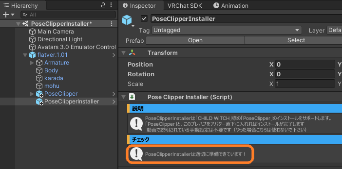
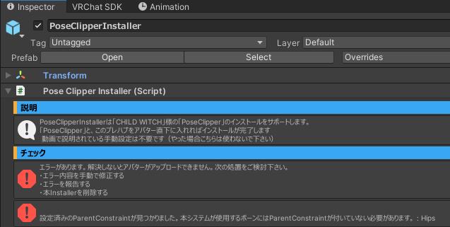

# PandraBox/PoseClipperInstaller

- [PandraBox/PoseClipperInstaller](#pandraboxposeclipperinstaller)
  - [概要](#概要)
  - [導入方法](#導入方法)
  - [トラブルシューティング](#トラブルシューティング)
    - [アップロードできない](#アップロードできない)
    - [アップロードできたが一部の固定ができない](#アップロードできたが一部の固定ができない)
    - [アップロードできたがWorld固定すると頭が小さくなる](#アップロードできたがworld固定すると頭が小さくなる)
    - [Av3Emulator等で動作確認したい](#av3emulator等で動作確認したい)
  - [謝辞](#謝辞)
  - [ライセンス](#ライセンス)
  - [サポート窓口](#サポート窓口)

## 概要
CHILD WITCH様の[PoseClipper](https://booth.pm/ja/items/6181080)を非破壊的・簡単手順で導入できるようにするツールです

## 導入方法

- 使用したいプロジェクトをバックアップして下さい
- プロジェクトを開いて下さい
- もしModularAvatar未導入/わからない場合は同梱のDependics/ModularAvatarInstaller.unitypackageをインポートして下さい
- [PoseClipper](https://booth.pm/ja/items/6181080), PoseClipperInstallerをインポートして下さい
- アバターの下にPoseClipperのプレハブを入れて下さい

- 同様にPoseClipperInstallerのプレハブを入れて下さい

- PoseClipperInstallerのInspectorを確認してエラーの無いことを確認して下さい

- 導入完了です。アバターアップロードすることでPoseClipperを使うことができます

## トラブルシューティング

- 困ったことや不明点があれば[お問い合わせ](#サポート窓口)下さい
- 一般的な不明点については次を参考になさって下さい

### アップロードできない

- まずはPoseClipperInstallerプレハブをアバターから消してみて下さい。それで治れば本アセットが原因です
  - PoseClipperInstallerには自己診断機能があり、トラブルがあるとInspectorにエラーが表示されます。エラーが出たままではアップロードできません。表示内容に心当たりがあればアバター側の調整をお願いいたします。
 

  - Inspectorでエラーが出ていないのにアップロードできない場合、他アセットとの相性問題である可能性が高いです。Humanoid BoneへConstraintを追加するアセットとは競合します
- 本アセットで導入できなかった場合本アセットを削除し[PoseClipper公式の導入手順](https://docs.google.com/document/d/1dEL528KqOMokr0Gev5jIFtgla3eq-V66mQ5x-yn13aE/edit?tab=t.0#heading=h.toe88i3m7hyc)を試して下さい。合わせて[お問い合わせ](#サポート窓口)頂けると幸いです

### アップロードできたが一部の固定ができない

- Constraintの設定に何等かの問題が起きている可能性が高いです。MA ObjectReplace等でArmatureの置き換えをしていないかご確認下さい

### アップロードできたがWorld固定すると頭が小さくなる

- HeadへのScale Constraint設定に何等かの問題が起きています。MA ObjectReplace等でArmatureの置き換えをしていないかご確認下さい

### Av3Emulator等で動作確認したい
- PlayモードにしてAllClip,WorldFixedをOnにします
- Sceneで移動させると判定だけ動いてアバターがロックされていることが確認できます
- T Pose Calibrationなどを実行するとアバターがロックされていることが確認できます
- Armatureの様々な場所にConstraintが追加されていることが確認できます

## 謝辞

- 本アセットの作成・検証にあたりCHILD WITCH様には貴重なご意見やご協力を頂きました。厚く御礼申し上げます。

## ライセンス

- Booth展示・本サイト掲示用ロゴ画像には、MingCute様の画像素材を使用させて頂いています。[Apache2.0ライセンス](https://github.com/Richard9394/MingCute?tab=Apache-2.0-1-ov-file#readme)の元で提供されています。ロゴとして使用するにあたり、色の変更・重ね表示の加工を行っています。
- PoseClipperInstallerのライセンスは[MITライセンス](https://opensource.org/license/mit)で提供されています。ソースコードは全てBooth配布物に含まれています
- PoseClipperのライセンスは[公式Booth](https://booth.pm/ja/items/6181080)を御覧ください

## サポート窓口
- 不具合報告・不明点・感想などお気軽にご連絡下さい。お急ぎの際は複数窓口への連絡をお願いいたします
- PoseClipperInstallerを導入した環境で起きている全ての事象について広く受け付けております（PoseClipper本体の問題かどうかの切り分けは不要です）
  - [PandraBox問い合わせフォーム](https://forms.gle/x5TvUhqvWwBjQZcn6)
  - [Booth問い合わせフォーム](https://pandrabox.booth.pm/)
  - [X](https://x.com/pandra_gmk)