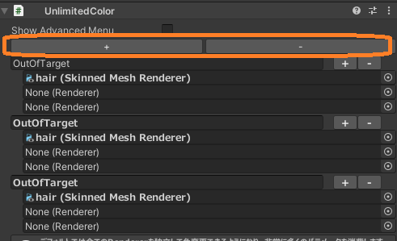

# PandraBox/UnlimitedColor

- [PandraBox/UnlimitedColor](#pandraboxunlimitedcolor)
  - [概要](#概要)
  - [使用方法](#使用方法)
    - [基本的な使用方法](#基本的な使用方法)
    - [グルーピング](#グルーピング)
    - [高度な設定](#高度な設定)
  - [どうしてもパラメータが足りない時：VRCFury ParameterCompressorの使い方](#どうしてもパラメータが足りない時vrcfury-parametercompressorの使い方)
  - [トラブルシューティング](#トラブルシューティング)
    - [アップロードできない](#アップロードできない)
    - [色が変わらない(自分視点)](#色が変わらない自分視点)
    - [色が変わらない(他者視点)](#色が変わらない他者視点)
    - [グループの設定と実際のグループが違う](#グループの設定と実際のグループが違う)
    - [完全にアンインストールしたい](#完全にアンインストールしたい)

## 概要
[lilToon](https://lilxyzw.github.io/lilToon/)を使ったオブジェクトをVRC内で色変更できるようにする非破壊ツールです

## 使用方法

### 基本的な使用方法
- 使用したいプロジェクトをバックアップする
- プロジェクトを開く
- Unitypackageをインポートする
 
- Packages/UnlimitedColor/Samples内にあるプレハブをアバター直下に入れる

> 基本的にはこれで導入完了ですが、このままだと全てのRendererを1つ1つバラバラに色変更する設定になっており、Rendererの数×4つのfloatを使います。アバターによってはアップロードできないことがあります

### グルーピング
- アバターに入れたUnlimitedColorプレハブをクリックして、Inspectorを見る

- OutOfTargetと書いてある場所の右にある+-ボタンを押すとその下の枠が増減する

- その枠にレンダラーを入れると、入れたものは色変更対象から除外される

- 一番上の+-ボタンを押すと、入力欄が増える
    - この時最後の要素がコピーされますが、意味はないので削除して下さい

- 自由な名前をつけて、グループ化したいレンダラーを入れる。ここでグループ化したものは同時に色が変わるようになる
    - グループ名とオブジェクト名はそれぞれ重複しないようにして下さい
    - グループ化すると1グループあたり4つのfloatを使います。まとめる程使うパラメータが減るということです

> 多くの場合はここまででの設定で良いと思われます

### 高度な設定
- Show Advanced Menuを開くと高度な設定にアクセスすることができます

- FixMAMBT
    - レイヤの順序を制御します。基本的にチェックを入れておけばいいです。主にMMD等での表情動作に影響します
- (Saturation/Value/Gamma) Max
    - 各種色調補正の上限値を変更できます。デフォルトはシェーダー標準値の2に設定されています

## どうしてもパラメータが足りない時：VRCFury ParameterCompressorの使い方
***注意：VRCFuryとModularAvatarの併用は本来非推奨で、問題が起きやすいです。必ずバックアップを事前にとって問題に備えてください***
- [DANGER]VRCFuryParameterCompressorフォルダを開く
- VRCFury-installerとParameterCompressorをそれぞれインポートする

- Assets/pandrabox/ParameterCompressorをアバター直下にいれる

***使い方は以上のとおりですが、使う前に次を知っておいて下さい***
- VRCFury ParameterCompressorはExpressionMenuで使用されている全てのFloatとIntを合計16bitの同期ビットにします
    - 代償として、同期に時間がかかるようになります(これは本アセットのみならず、アバターのExpression Menuの操作が数秒遅れることを意味します)
- ParameterCompressorは原理的に非常に早くパラメータを切り替えることでこの機能を実現しています
    - VRC公式のAnimator Parametersの項には「shouldn't rely on it for fast sync」 (意訳：高速同期に依存すべきでない(かなり強い意志表示))という記述があり、ParameterCompressorはこの記述に抵触している可能性が高いです
    - これの使用はVRChatのサーバに過剰な負荷をかける行為かもしれません
- UnlimitedColorは非常に多くのパラメータを使うためこういった圧縮技術の利用が必要な場面がありますが、以上について理解の上適正な利用をお願いいたします

## トラブルシューティング
### アップロードできない
- まずはUnlimitedColorプレハブをアバターから消してみて下さい。それで治れば本アセットが原因です
- 多くの場合、パラメーター使用量オーバーが原因です。上記説明を読んで除外・グループ化・ParameterCompressorの利用等を検討して下さい
    - VRCで使えるパラメーターは1アバター最大256bitです
    - 本ギミックは1グループ又はグループ化されていないレンダラー1つあたりfloat4つ、つまり32bit使います
        - つまり、本ギミック対象が9個あればそれだけでアップロードできなくなります（実際には他のギミックでもパラメータは使いますので、5個くらいであっても非常に厳しいでしょう)
### 色が変わらない(自分視点)
- 本アセットはliltoonの機能を呼び出しているだけであるため、liltoon以外のシェーダーを使っている場合色が変わりません
### 色が変わらない(他者視点)
- 本アセットによって変更された色を見るためにはセーフティ設定にてアニメーションやシェーダーのカスタムをONにする必要があります。すなわち、フレンド以外には多くの場合元の色で表示されています
### グループの設定と実際のグループが違う
- グループ名の重複が起きているかもしれません。ご確認下さい
- アバターに2つのUnlimitedColorが入っているかもしれません。その場合動作するのはどちらか片方だけです。基本的には1つだけ入れるようにしましょう
### 完全にアンインストールしたい
- VCCのプロジェクト設定からUnlimitedColor(必要に応じVRCFury)を外して下さい

