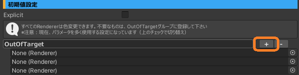

# PandraBox/UnlimitedColor
 

- [PandraBox/UnlimitedColor](#pandraboxunlimitedcolor)
  - [概要](#概要)
  - [導入方法](#導入方法)
  - [各種設定](#各種設定)
    - [設定画面の開き方](#設定画面の開き方)
    - [使用Bit数](#使用bit数)
    - [色調最大値設定](#色調最大値設定)
    - [初期値設定\_Explicit:OFF](#初期値設定_explicitoff)
    - [初期値設定\_Explicit:ON](#初期値設定_expliciton)
    - [グルーピング](#グルーピング)
    - [未定義のlilToon Renderer](#未定義のliltoon-renderer)
  - [VRCFury ParameterCompressor](#vrcfury-parametercompressor)
  - [トラブルシューティング](#トラブルシューティング)
    - [アップロードできない](#アップロードできない)
    - [色が変わらない(他者視点)](#色が変わらない他者視点)
    - [グループの設定と実際のグループが違う](#グループの設定と実際のグループが違う)
    - [完全にアンインストールしたい](#完全にアンインストールしたい)

## 概要
[lilToon](https://lilxyzw.github.io/lilToon/)を使ったオブジェクトをVRC内で色変更できるようにする非破壊ツールです

## 導入方法

- 使用したいプロジェクトをバックアップして下さい
- プロジェクトを開いて下さい
- Unitypackageをインポートして下さい
 
- Packages/UnlimitedColor/Samples内にあるプレハブをアバター直下に入れて下さい

> 基本的な導入はこれで完了しました！もしあなたが使っているアバターがとてもシンプルなものだったらこのままアップロードできるかもしれません。
> UnlimitedColorは大量のパラメータを使うので、アップロードできなくなっていることもあります。その場合は次の各種設定を行い、削減していきましょう

## 各種設定

- 次を目的として各種設定を行っていきます
  - 使用パラメータを削減するため
  - 同じ色合いであるべきものを同時に変化させて使いやすくするため
  - 表現の幅を広げるため

### 設定画面の開き方

- Hierarchyから、導入したプレハブをクリックします
- Inspectorに設定画面が表示されます

### 使用Bit数

- 読み取り専用の項目です
- UnlimitedColorが使用しているBit数が書いてります
- アップロードするためにはアバター全体で使用Bitを256以下にする必要があります

### 色調最大値設定

- それぞれ彩度、明度、ガンマの最大値を定義します
- 基本値はlilToon標準の2です

### 初期値設定_Explicit:OFF

- グループ定義していないRendererの色を変更可能かどうかを設定します
- OFF(標準)の場合、グループ定義していないRendererは全て１つ１つ色変更が可能です
  - Renderer1つあたり32Bit消費します
- OutOfTarget欄にRendererを設定すると、設定したRendererは色変更が無効化されます

### 初期値設定_Explicit:ON

- ExplicitをONに設定した場合、グループ定義していないRendererは色変更できません
- この設定では大幅にパラメータ消費が減りますが、色変更を全て手動登録する必要があります

### グルーピング

- +ボタンを押すとグループが追加されます。グループ名を定義します
- 更に+ボタンを押しRenderer登録枠を表示させます。枠にRendererを登録します
- 定義したグループ名がExpressionMenuに表示されます。登録したRendererは同時に色が変化します
  - グループ1つあたり32Bit消費します。なるべくまとめることで、相対的にパラメータ削減が可能です

### 未定義のlilToon Renderer

- グループに登録していないlilToonのRendereが表示されます
  - Explicit=OFFの場合、これらは色変更できるが、1つあたり32Bit消費します
  - Explicit=ONの場合、これらは色変更できません
- クリックすると、Hierarchy上でそのRendererがアクティブになります

## VRCFury ParameterCompressor

- **重大な注意1：VRCFuryとModularAvatarの併用は本来非推奨で、問題が起きやすいです。必ずバックアップを事前にとって問題に備えてください**
- **重大な注意2：VRCFuryは頻繁に破壊的変更があり、導入しているだけで突然アバターがアップロードできなくなる事があります**

- UnlimitedColorは非常に多くのパラメータを必要とします。基本的にはグルーピングや対象の取捨選択でパラメータ削減することが好ましいですが、どうしてもそれが難しい場合擬似的に制限を超えてパラメータを使用する方法があり、その紹介です
- 注意事項として、上記の重大な注意2つの他、ExpressionMenuに登録されている全てのInt,Floatの同期が遅くなります
- 導入手順は次のとおりです
  - [公式サイト](https://vrcfury.com/)よりVCCに登録します
  - プロジェクトに追加し、プロジェクトを開きます
  - アバター直下に空のGameObjectを作成し、ParameterCompressorをアタッチします
  - 以上で導入完了です。全てのfloat合わせて16Bitの使用に削減されます。

## トラブルシューティング

### アップロードできない

- まずはUnlimitedColorプレハブをアバターから消してみて下さい。それで治れば本アセットが原因です
  - 治らなかったら別の問題となります。もしVRCFuryを導入している場合は、削除をお勧めします
- UnlimitedColorが原因でアップロードできない殆どの場合、パラメータ使用量オーバーが原因です。パラメータ使用量を削減するには次のような方法があります
  - Explicit=ONに設定し、必要なもののみグループ定義する
  - Explicit=OFFに設定し、不要なものを全て除外する
  - なるべく少ないグループに纏める
  - VRCFury ParameterCompressorを利用する

### 色が変わらない(他者視点)

- 本アセットによって変更された色を見るためにはセーフティ設定にてアニメーションやシェーダーのカスタムをONにする必要があります。すなわち、フレンド以外には多くの場合元の色で表示されています
- VRCFury ParameterCompressorを利用している場合、色変更後同期されるまでに若干のタイムラグが存在します

### グループの設定と実際のグループが違う

- グループ名・単体のオブジェクト名が重複している場合複雑な不具合が発生します。名前の重複がないか確認し、ある場合は解消して下さい
- アバターに2つのUnlimitedColorが入っている場合、どちらか片方だけが動作します。基本的には1つだけ入れるようにして下さい

### 完全にアンインストールしたい

- VCCのプロジェクト設定から次を削除して下さい
  - UnlimitedColor
  - PandraVase (UnlimitedColorを消せば自動的に消えるはずです)
  - VRCFury (導入した場合のみ)

